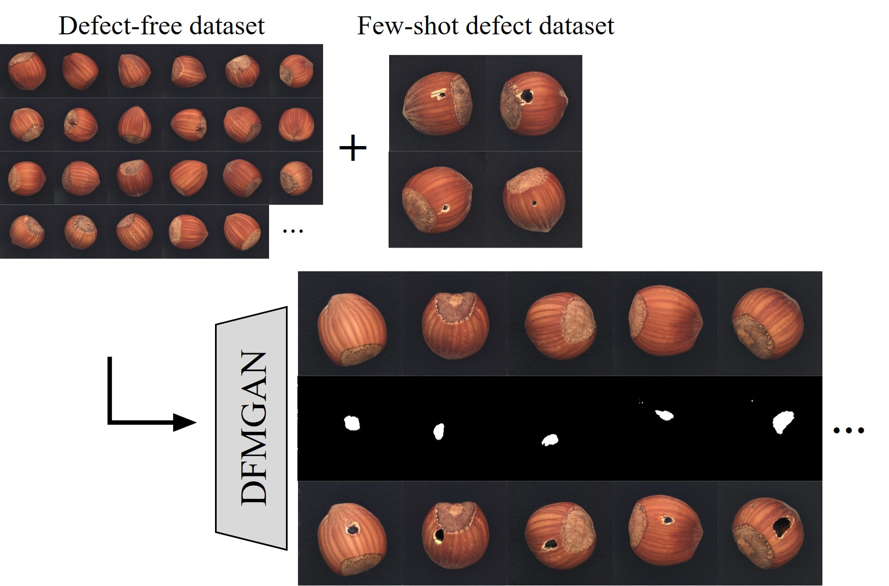
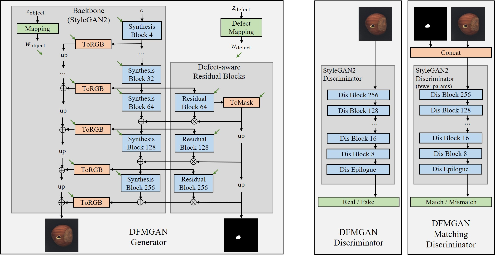

# Defect-aware Feature Manipulation GAN



This repository is the official implementation of the following paper, which focuses on defect/anomaly generation for downstream tasks in industries:

> **Few-Shot Defect Image Generation via Defect-Aware Feature Manipulation**<br>
> [Yuxuan Duan](https://github.com/Ldhlwh), [Yan Hong](https://github.com/hy-zpg), [Li Niu](http://www.ustcnewly.com/), [Liqing Zhang](https://bcmi.sjtu.edu.cn/~zhangliqing/)<br>
> The 37th AAAI Conference on Artificial Intelligence (AAAI 2023)<br>
> https://arxiv.org/abs/2303.02389<br>



## Update Notes

- **Jul. 26, 2024** :warning: Some issues have been marked as [*good first issue*](https://github.com/Ldhlwh/DFMGAN/issues?q=is%3Aissue+label%3A%22good+first+issue%22+is%3Aclosed). You are welcome to check on them if you
    - encounter errors w.r.t. plugins, especially bias_act and upfirdn2d;
    - have insufficient VRAM;
    - fail to render good defect-free images in the first stage (e.g. completely wrong color or orientation).
- **Dec. 21, 2023** Pretrained ```hazelnut_good.pkl``` and ```hazelnut_hole.pkl``` are now available [here](https://drive.google.com/drive/folders/17LQeN3uFalD_wWqcObNLbbH3nsssmCfh?usp=sharing) for a quick trial.

## Getting Started

- :warning: This repository is based on the official NVIDIA implementaion of [StyleGAN2-ADA](https://github.com/NVlabs/stylegan2-ada-pytorch). Follow the [requirements](https://github.com/NVlabs/stylegan2-ada-pytorch#requirements) of it before the steps below. (Docker is not supported. Windows might probably do with minor modification, yet have not been tested.)
- Additional python libraries: ```pip install scipy psutil lpips tensorboard```.
- Clone the repository:
    ```shell
    git clone https://github.com/Ldhlwh/DFMGAN.git
    cd DFMGAN
    ```
    
## Dataset

- Download the [MVTec Anomaly Detection (MVTec AD)](https://www.mvtec.com/company/research/datasets/mvtec-ad/) dataset and unzip the archive files under ```./data```. (If you wish to try your own datasets, organize the defect-free images, defect images and the corresponding masks in a similar way.)
- Preprocess the dataset images into zip files for easy StyleGAN loading: (*e.g.* object category *hazelnut*, defect category *hole*)
    ```shell
    # Defect-free dataset for Stage 1
    python dataset_tool.py --source ./data/hazelnut/train/good \
        --dest ./data/hazelnut_good.zip \
        --width 256 --height 256
    
    # Defect image & mask dataset for Stage 2
    python dataset_tool.py --source ./data/hazelnut/test/hole \
        --source-mask ./data/hazelnut/ground_truth/hole \
        --dest ./data/hazelnut_hole_mask.zip --width 256 --height 256
    ```
    
## Stage 1: Pretrain

- **Update on 12/21/2023** You may skip this stage by downloading the pretrained ```hazelnut_good.pkl``` provided [here](https://drive.google.com/drive/folders/17LQeN3uFalD_wWqcObNLbbH3nsssmCfh?usp=sharing).
- Pretrain a StyleGAN2 model on defect-free images, using the default configuration ```auto```: (*e.g.* object category *hazelnut*)
    ```shell
    python train.py --data ./data/hazelnut_good.zip \
        --outdir runs/hazelnut_good \
        --gpus 2 --kimg 3000
    
    # If training for 3000 kimgs are not enough, you may resume the pretraining by
    python train.py --data ./data/hazelnut_good.zip \
        --outdir runs/hazelnut_good \
        --gpus 2 --kimg 3000 --resume runs/hazelnut_good/path/to/the/latest/model.pkl
        
    # You may also try different values for the following settings
    # --gpus: number of GPUs to be used
    ```
- Check the qualitative & quantitative results under ```./runs/hazelnut_good/*```. Chose a good model for the transfer in Stage 2. You may optionally make a copy as ```./pkls/hazelnut_good.pkl``` for easy loading.

## Stage 2: Transfer

- **Update on 12/21/2023** You may skip this stage by downloading the pretrained ```hazelnut_hole.pkl``` provided [here](https://drive.google.com/drive/folders/17LQeN3uFalD_wWqcObNLbbH3nsssmCfh?usp=sharing).
- Transfer the pretrained model to defect images with the defect-aware feature manipulation process: (*e.g.* object category *hazelnut*, defect category *hole*)
    ```shell
    python train.py --data ./data/hazelnut_hole_mask.zip \
        --outdir runs/hazelnut_hole --resume pkls/hazelnut_good.pkl \
        --gpus 2 --kimg 400 --snap 10 --transfer res_block_match_dis
    
    # You may also try different values for the following settings
    # --gpus: number of GPUs to be used
    # --lambda-ms: weight for the mode seeking loss
    # --dmatch-scale: the number of base channel/max channel of D_match
    ```
- The above process will by default compute FID@5k, KID@5k and Clustered LPIPS@1k on-the-fly per ```--snap``` ticks (*i.e.* $4 \times$```--snap``` kimgs). You may alter the metric list with ```--metrics```.
- Check the qualitative & quantitative results under ```./runs/hazelnut_hole/*```. You may optionally make a copy of a good model as ```./pkls/hazelnut_hole.pkl``` for easy loading.

## Inference: Defect Image Generation

- Generate 100 random defect images: (*e.g.* object category *hazelnut*, defect category *hole*)
    ```shell
    python generate.py --network pkls/hazelnut_hole.pkl \
        --output gen_img/hazelnut_hole
        
    # You may also try different values for the following settings
    # --seeds: specify the random seeds to be used
    # --num: number of generated images (only when --seeds is unspecified)
    # --gen-good: (flag) generate defect-free images along
    # --gen-mask: (flag) generate masks along
    ```
- Or, if you just wish to have a glimpse of the performance of a model, run the following command:
    ```shell
    python generate.py --network runs/hazelnut_hole/path/to/a/model.pkl --cmp
    ```
     to generate triplets of defect-free image, mask and defect image like Fig. 4 under the same directory with ```model.pkl```, named ```cmp<kimg>.png```.
     

## Citation
If you find DFMGAN helpful to your research, please cite our paper:
```
@inproceedings{Duan2023DFMGAN,
  title     = {Few-Shot Defect Image Generation via Defect-Aware Feature Manipulation},
  author    = {Yuxuan Duan and Yan Hong and Li Niu and Liqing Zhang},
  booktitle = {AAAI},
  year      = {2023}
}
```

## Acknowledgements

- The work was supported by the National Science Foundation of China (62076162), and the Shanghai Municipal Science and Technology Major/Key Project, China (2021SHZDZX0102, 20511100300).
- This repository have used codes from [StyleGAN-ADA](https://github.com/NVlabs/stylegan2-ada-pytorch) and [LPIPS](https://github.com/richzhang/PerceptualSimilarity).
